<h1>Threat Detection with Yara</h1>

<h2>Description</h2>
A walkthrough guide for Yara
<br />

<h2>Environments Used </h2>

- <b>Ubuntu</b>
- <b>VMWare</b>

<h2>Walk-through:</h2>

<p align="center">
<h2>1. Installing and Compiling Yara </h2>
<br/>
<b>Open the browser in the Ubuntu virtual machine, then navigate to the official GitHub releases page for YARA: https://github.com/VirusTotal/yara/releases </b>
<br />
<br />
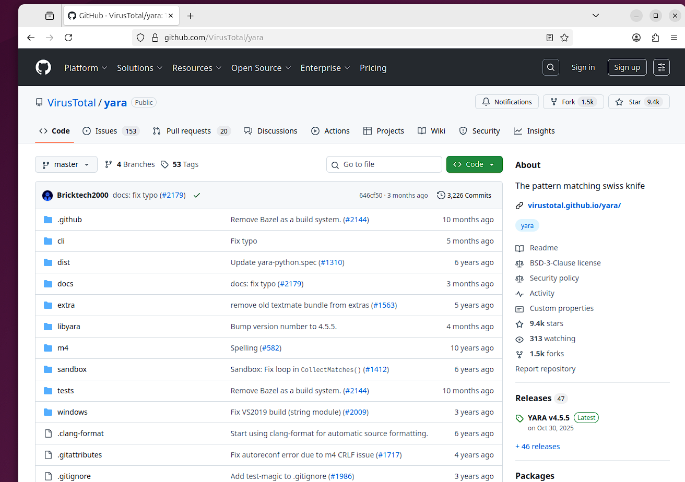
<b>Download the YARA source archive (e.g., yara-4.5.5.tar.gz or the latest release) into the Downloads directory.</b>
<br />
<br />

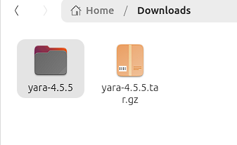
<b>Open a terminal and change to the Downloads directory</b>
<br />
<br />
<b>Extract the archive and enter the extracted directory (adjust the filenames to match the version you downloaded):
tar -zxf yara-4.5.5.tar.gz 
cd yara-4.5.5
</b>
<br />
<br />
<b>
You should now be inside the yara-4.5.5 directory.
</b>
<br />
<br />
<b>Install the required build tools:
sudo apt-get install automake libtool make gcc pkg-config
</b>
<br />
<br />
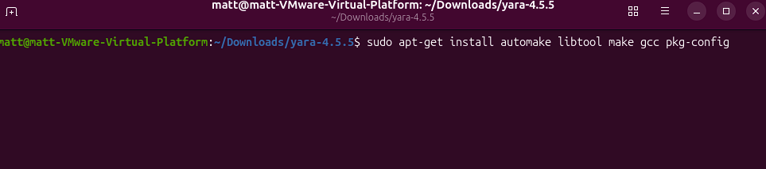
<b>After installation, generate the build system:
./bootstrap.sh
</b>
<br />
<br />

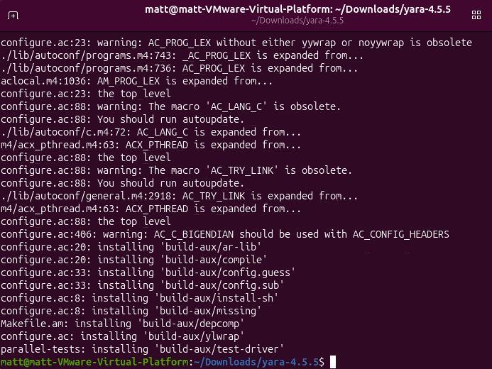
<b>Configure the build (OpenSSL will be detected automatically and crypto features enabled if present): 
./configure
</b>
<br />
<br />

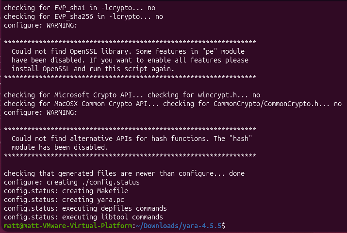
<b>Run the build:
make
</b>
<br />
<br />
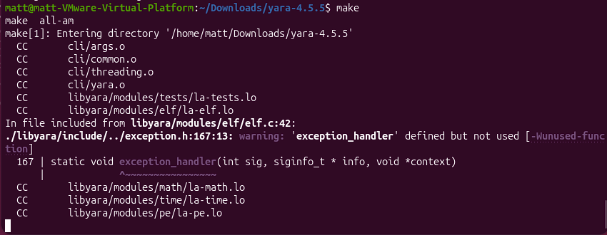
<b>Wait for the compilation to complete successfully.
Install YARA system-wide:
Sudo make install
</b>
<br />
<br />
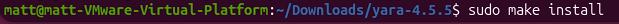
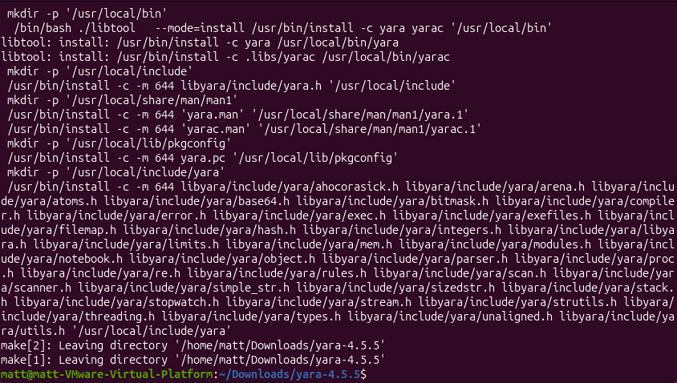
<b>This installs the binaries (yara, yarac) and the shared library (libyara.so), typically under /usr/local.
Verify the installation:
Yara --version
</b>
<br />
<br />
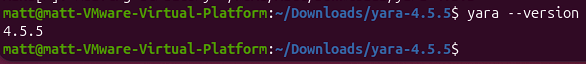
<b>Run the test suite to verify the build and configuration:
Make check
</b>
<br />
<br />

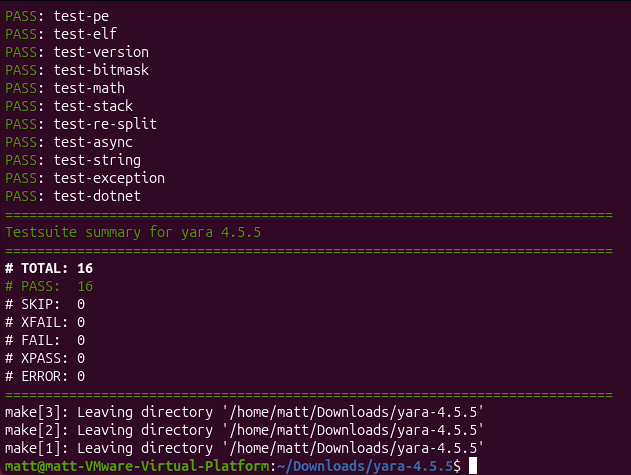
<b>Review the output for successful test results.</b>
<br />
<br />
  
<h2>2. Installing a module in Yara </h2>
<br/>
<b>I will use the Magicmodule in an upcoming experiment. Follow these steps to install the module when prompted in that section.
Install the required dependency:
sudo apt-get update 
sudo apt-get install libmagic-dev
sudo apt-get install libssl-dev
</b>
<br />
<br />
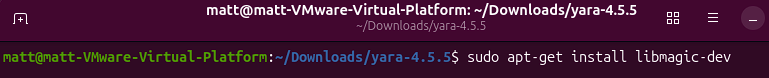

<b>Clean the previous build:
Make clean
</b>
<br />
<br />
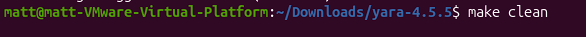
<b>Reconfigure with the Magic module enabled:
./configure –enable-magic
</b>
<br />
<br />
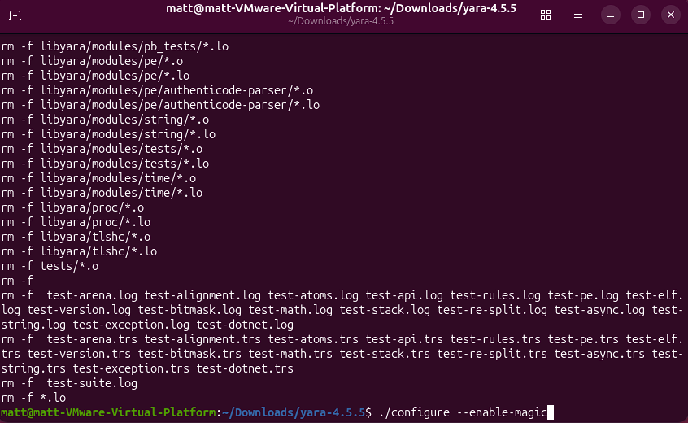

<b>(If you also want crypto support:)
./configure --with-crypto --enable-magic
</b>
<br />
<br />
<b>Rebuild and reinstall:
make 
</b>
<br />
<br />
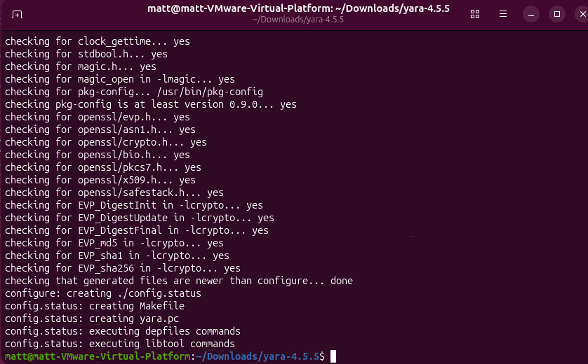
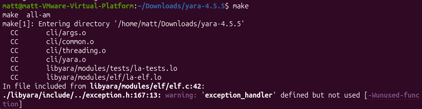
<b>
sudo make install
</b>
<br />
<br />
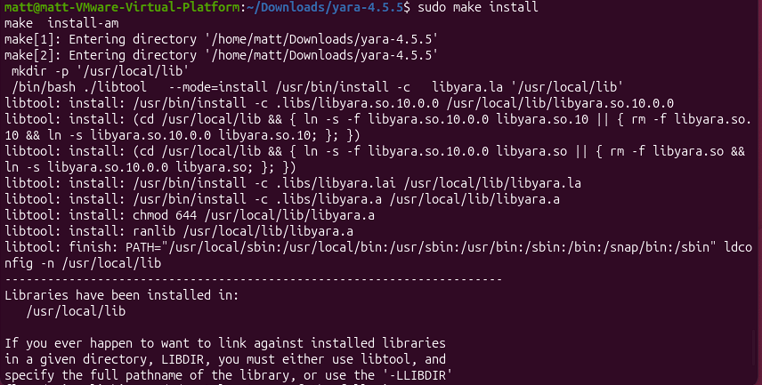
<b>Verify the Magic module is available:
yara -M
</b>
<br />
<br />
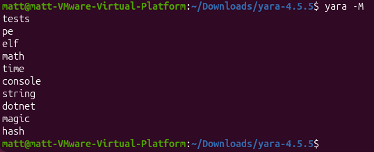
<b>The Magic module is now enabled.
Begin the experiment — follow along with the steps below to proceed.
</b>
<br />
<br />

<h2>3. String Based IoC Detection </h2>
<b>Create a test file:
echo "this file contains malicious_payload_123" > sample.txt
</b>
<br />
<br />
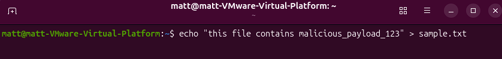
<b>Create a YARA rule:
nano string_test.yar
</b>
<br />
<br />
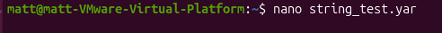
<b>Paste the following:
rule String_IOC_Test {   strings:
    $ioc = "malicious_payload_123"
  condition:
    $ioc
}
</b>
<br />
<br />
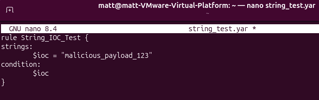
<b>Run YARA:
yara string_test.yar sample.txt
</b>
<br />
<br />
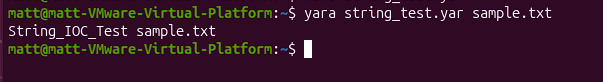
<b>✅ Confirms: basic IoC matching works.</b>
<br />
<br />

<h2>4. Hash based threat intelligence matching </h2>
<b>Get the file SHA-256:
sha256sum sample.txt
</b>
<br />
<br />
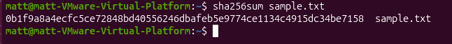
<b>Create the YARA rule:
nano hash_test.yar
</b>
<br />
<br />

<b>Paste and replace HASH with the SHA-256 value:
import "hash"

rule Hash_Match_Test {
  condition:
    hash.sha256(0, filesize) == "HASH"
}
</b>
<br />
<br />
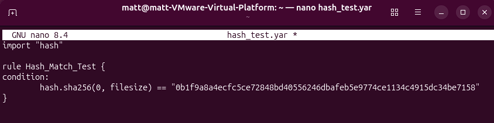
<br />
<b>Run the scan:
yara hash_test.yar sample.txt
</b>
<br />
<br />
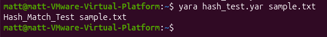
<br />
<b>✅ Confirms: hash-based detection works. </b>
<br />
<br />

<h2>5. Encoded content detection </h2>
<b>Create a sample base64 file:
echo "QUJDREVGR0hJSktMTU5PUFFSU1RVVldYWVphYmNkZWZnaGk=" > encoded.txt
</b>
<br />
<br />
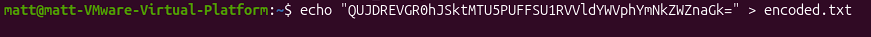
<b>Create the YARA rule:
nano base64_test.yar
</b>
<br />
<br />

<b>Paste the following:
rule Base64_Suspicion {
  meta:
    description = "Suspicious long base64-looking string"

  strings:
    $b64 = /[A-Za-z0-9+\/]{40,}={0,2}/

  condition:
    $b64
}
</b>
<br />
<br />
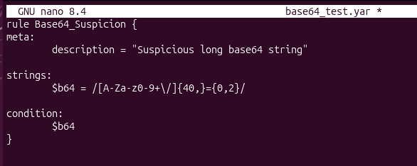
<br />
<b>Scan:
yara -s base64_test.yar encoded.txt
</b>
<br />
<br />
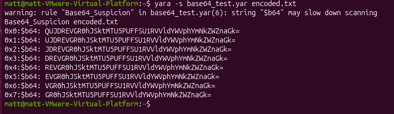
<br />
<b>You should see "Base64_Suspicion encoded.txt" — the test PASSED.
✅ Confirms: heuristic detection works.
</b>
<br />
<br />

<h2>6. File type detection using magic module </h2>
<b>Create a test text file:
echo "This is clearly a text file." > text_sample.txt
</b>
<br />
<br />
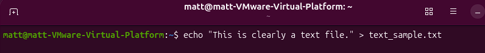
<b>Create the rule:
nano magic_test.yar
</b>
<br />
<br />
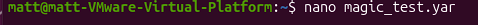
<b>Paste the following and save:
import "magic"

rule Detect_Text_File {
  meta:
    description = "Detect files whose real type is text/* using magic.mime_type"

  condition:
    magic.mime_type() matches /^text\//
}
</b>
<br />
<br />
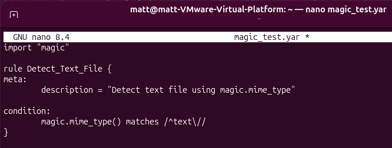
<br />
<b>Run the rule:
yara magic_test.yar text_sample.txt
</b>
<br />
<br />
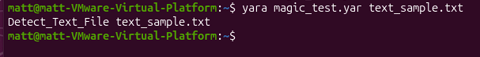
<br />
<b>✅ Confirms: The Magic module works.</b>
<br />
<br />

<h2>7. Windows malware-style logic </h2>
<b>Download a known PE (safe — Sysinternals tools are legitimate) and extract it:
wget https://download.sysinternals.com/files/PsExec.zip
unzip PsExec.zip
</b>
<br />
<br />
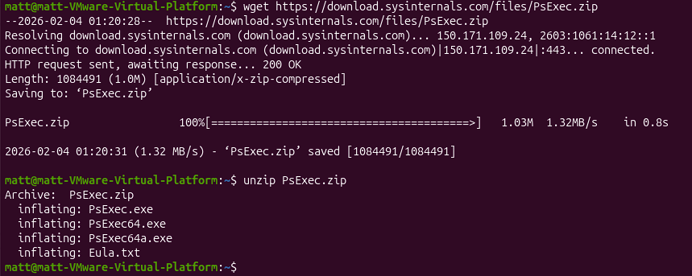
<b>Create the YARA rule:
nano pe_test.yar
Paste:
import "pe"
rule Detect_PE_File {
  condition:
    pe.is_pe
}
</b>
<br />
<br />
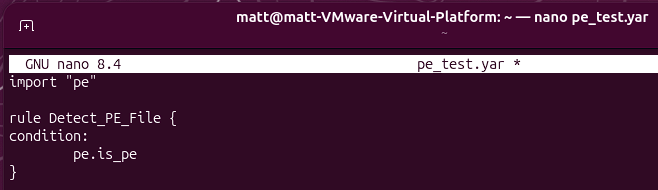
<b>Run the scan:
yara pe_test.yar PsExec.exe
</b>
<br />
<br />
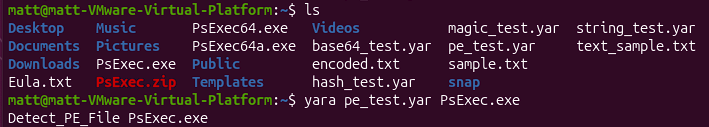
<b>✅ Confirms: PE module works (important).</b>
<br />
<br />

<h2>8. Directory Scanning (real-world usage)</h2>
<b>Create a lab folder and samples:
mkdir -p ~/yara_lab/samples
cd ~/yara_lab/samples
</b>
<br />
<br />
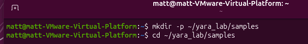
<b>Create sample files:
echo "This is just a normal text file." > note1.txt
echo "Another benign file with nothing special." > readme.txt
echo "malware_test_payload_12345" > fake_malware.bin
</b>
<br />
<br />
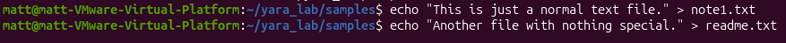
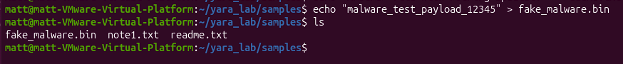
<b>Create a YARA rule for directory scanning:
cd ~/yara_lab
nano dir_scan_rules.yar
</b>
<br />
<br />
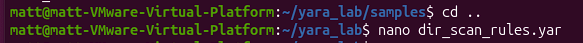
<b>Paste:
rule Contains_Malware_Word {
  meta:
    description = "Detect files containing the word 'malware'"
    author = "me"
    use_case = "directory scan test"

  strings:
    $mal = "malware"

  condition:
    $mal
}
</b>
<br />
<br />
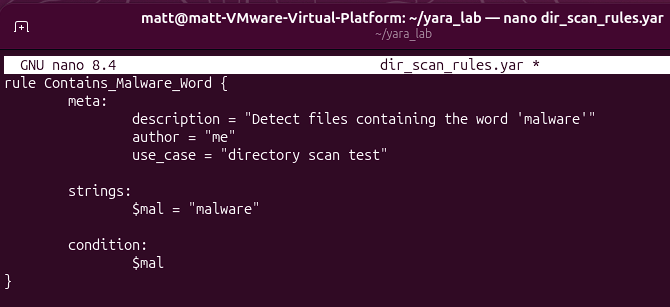
<br />
<b>Run a recursive scan:
yara -r dir_scan_rules.yar samples/
</b>
<br />
<br />
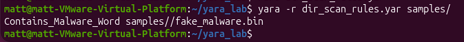
<br />
<b>✅ Confirms: bulk/directory scanning works.
</b>
<br />
<br />

<h2>Conclusion</h2>
<b>YARA is functioning correctly. The experiments confirmed:</b>
<br />
<br />
<b>
•	✅ String rules match
•	✅ Hash rules match
•	✅ Heuristic detection works
•	✅ PE and Magic modules work
•	✅ Recursive scans work
</b>
<br />
<br />
<b>
If all tests succeeded, your setup is ready for threat-intelligence use.
</b>
<br />
<br />

</p>

<!--
 ```diff
- text in red
+ text in green
! text in orange
# text in gray
@@ text in purple (and bold)@@
```
--!>
